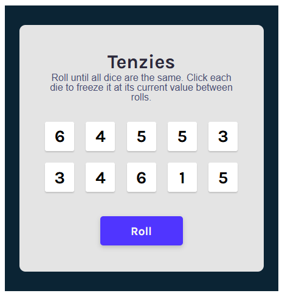

Capstone React project.

Basic Tenzies Game using react.

interface screenshot:

Visual Goal:
https://www.figma.com/design/FqsxRUhAaXM4ezddQK0CdR/Tenzies?node-id=0-1&p=f&t=1CLBIrJRiR4Zcffb-0 

** Extra milestones:

- Count the number of rolls
- Add a timer that keeps on screen the best time - (refreshing will reset)

